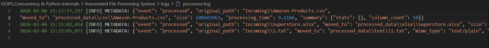
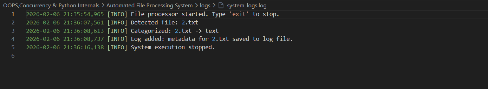

# AUTOMATED FILE PROCESSING SYSTEM

## INTRODUCTION

 Automated File Processing System processes files in a directory in run-time, categorize them based on their file extensions, and perform specific operations on them. The system is built using object-oriented programming principles and concurrent processing to handle multiple files efficiently.

## FEATURES

- File categorization based on file extensions
- Concurrent processing of files using threads
- Automatic movement of processed files to a separate directory
- Generation of summaries for processed files
- Logging of metadata for each processed file
- Support for different file formats (CSV, Excel, JSON, TXT)
- Error handling and logging

## LIBRARIES USED

- Pathlib for file path handling
- mimetypes for file type detection
- Pandas for data processing
- Watchdog for file monitoring
- Logging for logging metadata and errors
- ThreadPoolExecutor for concurrent processing

## SYSTEM ARCHITECTURE

1. File Categorization:
   - Files are categorized based on their extensions (e.g., CSV, Excel, JSON, TXT)
   - Each category has its own processing logic

2. Concurrent Processing:
   - Uses ThreadPoolExecutor to process files concurrently
   - Each file is processed in a separate thread
   - Maximum number of threads is configurable

3. File Movement:
   - Processed files are moved to a separate directory
   - Original files are left in the incoming directory

4. Summary Generation:
   - Generates summaries for processed files
   - Summaries are stored in JSON format
   - Summaries include statistics and column counts

5. Logging:
   - Logs metadata for each processed file
   - Logs errors and exceptions
   - Logs are stored in a log file
   - System Logs are also stored in a separate log file

## IMAGES

### Processed Files Log

### System Log

